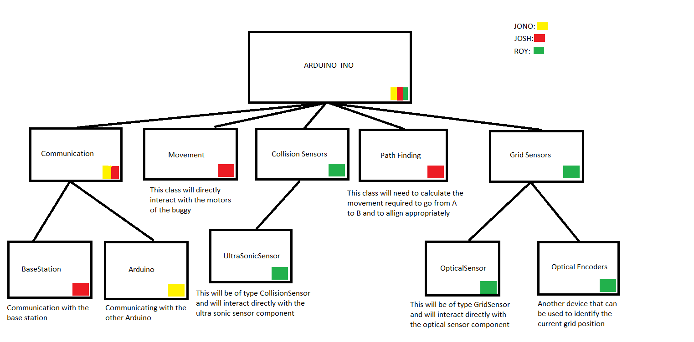

# Buggy-Project

# USE THE CODE INSIDE "IDE CODE"

# Ignore the comments below...

## Image processing
We will use clmg as the image processing library as its small and lightweight. All you need it the clmg.h file.
http://cimg.eu/

## Including headers in visual studio project
Project -> Properties -> C/C++ -> General -> Additional include directories

Then include the directory that contains your header/source files. This will allow you to reference them from other classes

## Sensor plan for finding orientation and position
- Use 2 infrared sensors on either side of a camera

### Finding the angle of intersection between the two adjacent white/black cells:
https://uk.mathworks.com/help/images/examples/measuring-angle-of-intersection.html
- Threshold the image to a black/white scale
- Perform a bwtraceboundary routine

### The sensors will identify the color of the cell directly below it
https://www.adafruit.com/product/1334
- The infrared sensors can detect the color of the cells

## Visual studio command line
- Type developer in start and it should come up

## Linking libcurl libraries
http://stackoverflow.com/questions/20171165/getting-libcurl-to-work-with-visual-studio-2013
- doesnt work yet

# Libraries
- nopencv_calib3d2413.lib
- nopencv_contrib2413.lib
- opencv_core2413.lib
- opencv_features2d2413.lib
- nopencv_flann2413.lib
- opencv_gpu2413.lib
- opencv_highgui2413.lib
- opencv_imgproc2413.lib
- opencv_legacy2413.lib
- opencv_ml2413.lib
- opencv_nonfree2413.lib
- opencv_objdetect2413.lib
- opencv_ocl2413.lib
- opencv_photo2413.lib
- opencv_stitching2413.lib
- opencv_superres2413.lib
- opencv_ts2413.lib
- opencv_video2413.lib
- opencv_videostab2413.lib

## Lib curl
- libcurl_a.lib

# Missing dlls
http://stackoverflow.com/questions/2694994/opencv-dll-missing-but-its-not

Also try (works):
https://msdn.microsoft.com/en-us/library/b8ttk8zy(v=vs.90).aspx

# Fixing the “MSVCP110D.dll is missing from your computer” issue
- See http://stackoverflow.com/questions/21458908/fixing-the-msvcp110d-dll-is-missing-from-your-computer-issue
